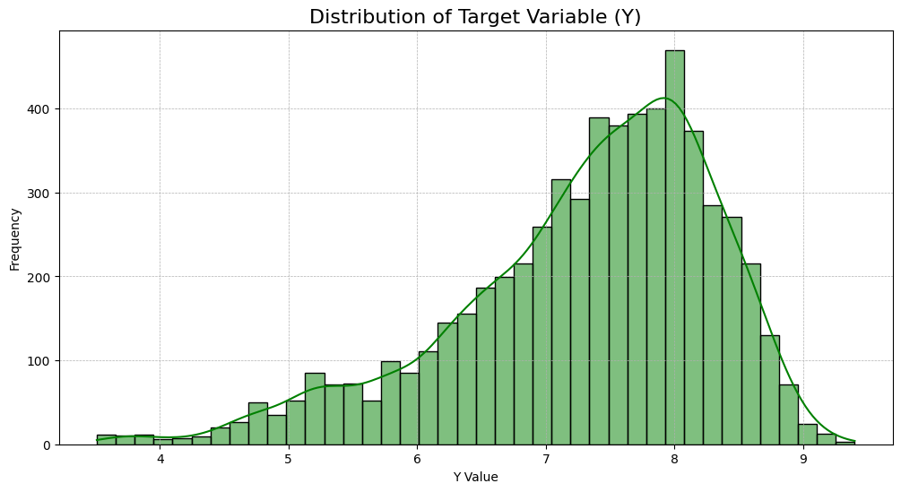
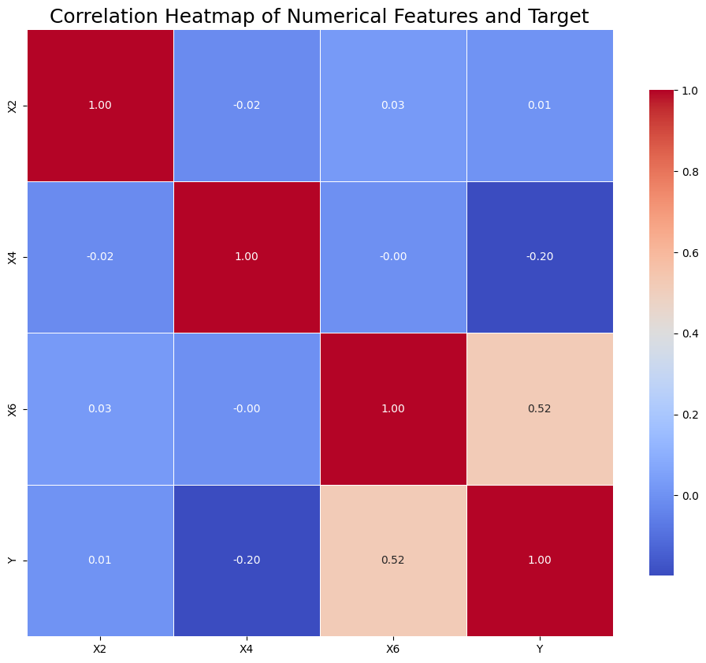
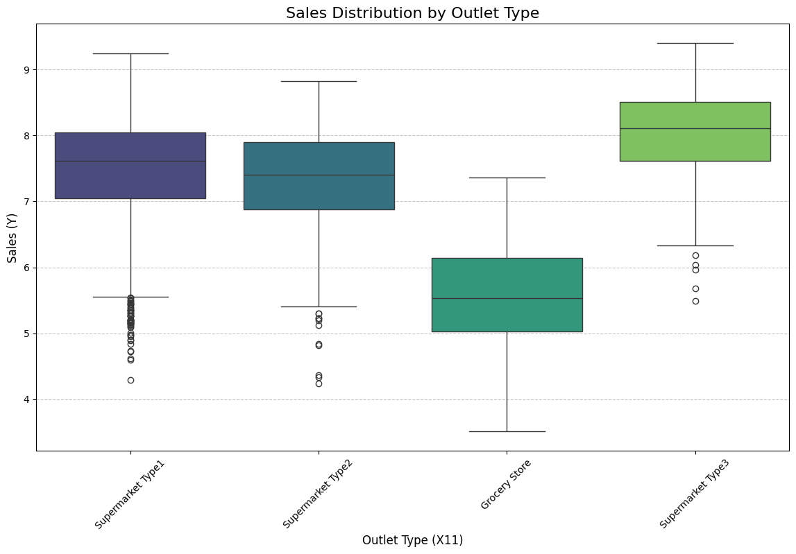
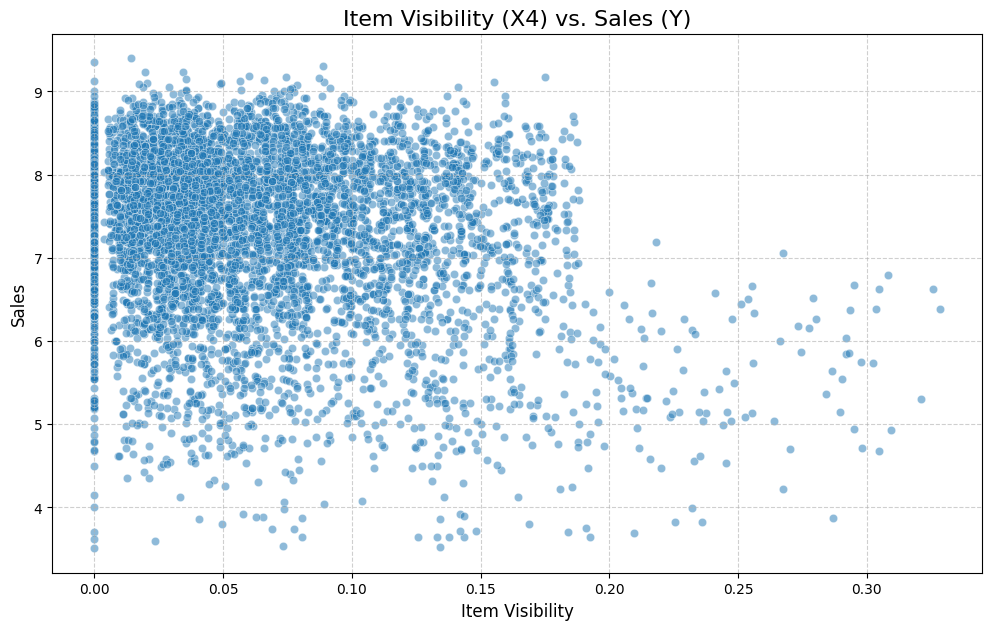

# AI Talents League R1: Sales Prediction Challenge 🚀

This repository contains my submission for the **AI Talents League Round 1** competition hosted by **Zaka Egypt**, focusing on predicting product sales. The project walks through a complete machine learning workflow, from initial data exploration to final model submission.

## 🏆 Competition Result

I'm proud to have achieved a **rank of `31` out of `109` participants** on the public leaderboard. This result was accomplished through a meticulous process of data cleaning, feature engineering, and robust modeling.

## 📖 Project Overview

The core task of this competition was to predict the sales (`Y`) for a range of products across different outlets. My approach is founded on the principle of **"understanding before predicting,"** ensuring that every decision is backed by data-driven insights. This notebook serves as a comprehensive guide to my methodology.

### 🚀 Workflow & Methodology

The solution follows a structured pipeline designed to maximize model performance:

1.  **Initial Setup & EDA:**
    * Loaded the dataset and performed an initial exploratory data analysis (EDA).
    * Visualized the distribution of the target variable (`Y`) to identify skewness and outliers.
    * Analyzed the properties of both numerical and categorical features.

2.  **Data Cleaning & Preprocessing:**
    * **Duplicate Removal:** Identified and removed duplicate rows to ensure data integrity.
    * **Missing Value Imputation:** Handled missing values using robust strategies: **median** for numerical columns and **mode** for categorical columns.
    * **Outlier Removal:** Visualized outliers using boxplots and removed them using the **Interquartile Range (IQR)** method to create a cleaner, more stable dataset for training.

3.  **Advanced Feature Engineering:**
    * **Item Categorization:** Engineered a new, low-cardinality feature `X0` by extracting the category prefix (e.g., 'FD' for Food, 'DR' for Drinks) from the high-cardinality item identifier `X1`.
    * **Categorical Data Standardization:** Cleaned inconsistent values in feature `X3` (e.g., 'low fat', 'LF') by mapping them to standardized categories ('Low Fat', 'Regular').
    * **Encoding & Scaling:** Applied `OrdinalEncoder` for features with a clear order, `OneHotEncoder` for nominal features, and `RobustScaler` for numerical features to prepare the data for the model.

4.  **Modeling & Prediction:**
    * Trained a powerful `RandomForestRegressor` model on the processed data.
    * Generated predictions on the preprocessed test set.
    * Formatted the output into the required `submission.csv` format.

---

## 💡 Key Challenges & Solutions

Several data-related challenges were identified and addressed during the project:

* **Challenge: High-Cardinality Identifier (`X1`)**
    * The `X1` column contained thousands of unique item IDs, which could lead to overfitting and the curse of dimensionality if one-hot encoded.
    * **Solution:** Instead of using the ID directly, I engineered a more general `Item_Category` feature (`X0`) from its prefix. This captured the essential information (Food, Drink, etc.) without overwhelming the model.

* **Challenge: Inconsistent Categorical Data**
    * The `X3` column had multiple representations for the same concept (e.g., 'low fat', 'LF', 'reg').
    * **Solution:** I standardized these values into two consistent categories ('Low Fat' and 'Regular') to ensure the model could learn a clear pattern.

* **Challenge: Outliers in Numerical Features**
    * Boxplots revealed the presence of significant outliers that could skew the model's training and negatively impact its performance.
    * **Solution:** I implemented a robust outlier removal strategy based on the **Interquartile Range (IQR)**, which effectively trimmed extreme values before feeding the data to the model.

---

 
## 📊 Visual Data Storytelling: Key Insights from EDA

A deep dive into the data uncovered several key patterns that guided the feature engineering and modeling process.

### 1. Sales Distribution (The Target)
The histogram revealed a left-skewed distribution, indicating that higher sales values are more frequent.

*Image showing the histogram of the sales variable 'Y'.*

### 2. Correlation Heatmap
The heatmap showed linear relationships between numerical features, with a notable positive correlation between X2 and X6.


*Image of the correlation heatmap.*

### 3. Sales by Outlet Type
Boxplots revealed that Supermarket Type3 outlets generally have the highest median sales, highlighting the importance of this feature.


*Image of the boxplot comparing sales across different outlet types.*

### 4. Item Visibility vs. Sales
The scatterplot showed that many products with zero visibility were still generating sales, suggesting potential data anomalies.


*Image of the scatterplot for Item Visibility vs. Sales.*


---
## 🛠️ Tech Stack

* **Language:** Python
* **Core Libraries:** Pandas, NumPy, Scikit-learn
* **Visualization:** Matplotlib, Seaborn
* **Environment:** Kaggle Notebooks
---
## 📂 How to Use

1.  Clone this repository:
    ```bash
    git clone https://github.com/Jasmine25005/AITalents-Sales-Prediction.git
    ```
2.  Download the dataset from the [AI Talents League Round 1 Kaggle competition page](https://www.kaggle.com/competitions/ai-talents-league-round-1).
3.  Place the `train.csv` and `test.csv` files in the project directory.
4.  Run the Jupyter Notebook to execute the full analysis and generate the `submission.csv` file.
